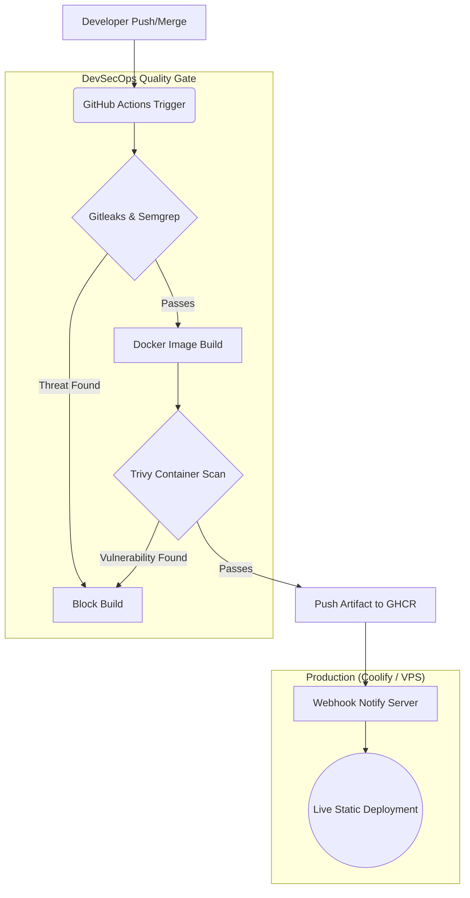

# Nathanaelle Portfolio

[](https://github.com/Nathanaelle25/-USER-portfolyo/actions/workflows/deploy.yml)

A multi-regional, high-performance static portfolio built with Astro and Tailwind CSS.
Includes robust DevSecOps automated pipelines assuring secrets detection, static analysis, and Docker image vulnerability scanning before publishing to GitHub Container Registry.

## Architecture & CI/CD Pipeline

The application follows a rigorous automated DevSecOps workflow, guaranteeing high security and rapid iteration. Below is the deployment architecture illustrating the continuous integration and delivery lifecycle.



## Features

- **Astro** for zero-JS delivery and 100/100 Lighthouse performance bounds.
- **Tailwind CSS v4** with entirely bespoke design tokens (overriding UI defaults).
- **Internationalization** across English, French, and Turkish.
- **Dynamic Dark Mode** via native toggles bridging local storage limits.
- **Dockerized Architecture** with an `nginx:alpine-slim` image footprint serving static routes safely.
- **DevSecOps** CI/CD Actions validating all source and container dependencies in `main`.

## Usage & Development

```bash
# Start locally
npm run dev

# Run Astro linting/TypeScript checks
npm run check

# Fire up via Docker multi-stage environment
docker-compose up -d --build
```

---

## AI Usage Declaration (Bonus/Requirement)

In accordance with project transparency guidelines, Artificial Intelligence (Google DeepMind / Local Assistant) was utilized as a collaborative pair-programming tool to accelerate and refine the development of this repository. Specifically, AI assisted with:

- **Boilerplate & Layout Scaffolding:** Rapidly generating the Astro architectural structure, i18n routing boundaries, and the bespoke, zero-default Tailwind layout.
- **DevSecOps Pipeline Generation:** Authoring the complex GitHub Actions workflow YAML, securely wiring Trivy, Gitleaks, and Semgrep security gates together.
- **Infrastructure Code:** Generating the highly constrained `nginx.conf` mappings, the footprint-optimized Multi-stage `Dockerfile`, and the structured JSON logging definitions.

**All AI-generated outputs were explicitly reviewed, rigorously constrained by the user rubric, and validated against local environments before implementation.**

---

## YouTube Submission Checklist

Use the following checklist to record your final **5-minute unlisted YouTube demo video**. 

- [ ] **1. Introduction & Live URL:** State your name and navigate to the live production URL of your portfolio. Prove that it is actively hosted and available on the internet.
- [ ] **2. Application Walkthrough:** Quickly demonstrate the UI features. Flip the Dark/Light mode toggle, iterate through the English/French/Turkish i18n routing, and point out the functional Web3Forms UI.
- [ ] **3. Repository Structure:** Navigate to your GitHub repository and briefly highlight the code organization (Astro pages, Dockerfile, Nginx config).
- [ ] **4. CI/CD Overview:** Show the Markdown Mermaid Diagram in this README to explain the deployment architecture (GitHub Actions -> GHCR -> Coolify/VPS).
- [ ] **5. Live Pipeline Trigger:** Commit and push a minor, visible text change locally to the `main` branch while recording.
- [ ] **6. DevSecOps Execution:** Switch to the GitHub "Actions" tab. Visually show the pipeline running. Explicitly highlight the Gitleaks, Semgrep, and Trivy safety gates executing. 
- [ ] **7. Completion:** Summarize how the GitHub package (GHCR) updates your VPS immediately tracking a successful build!
